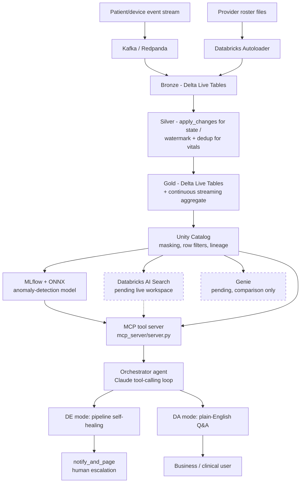
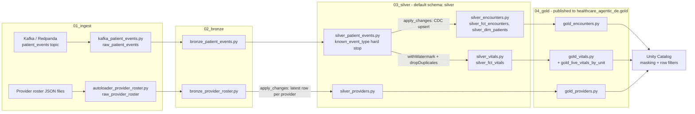
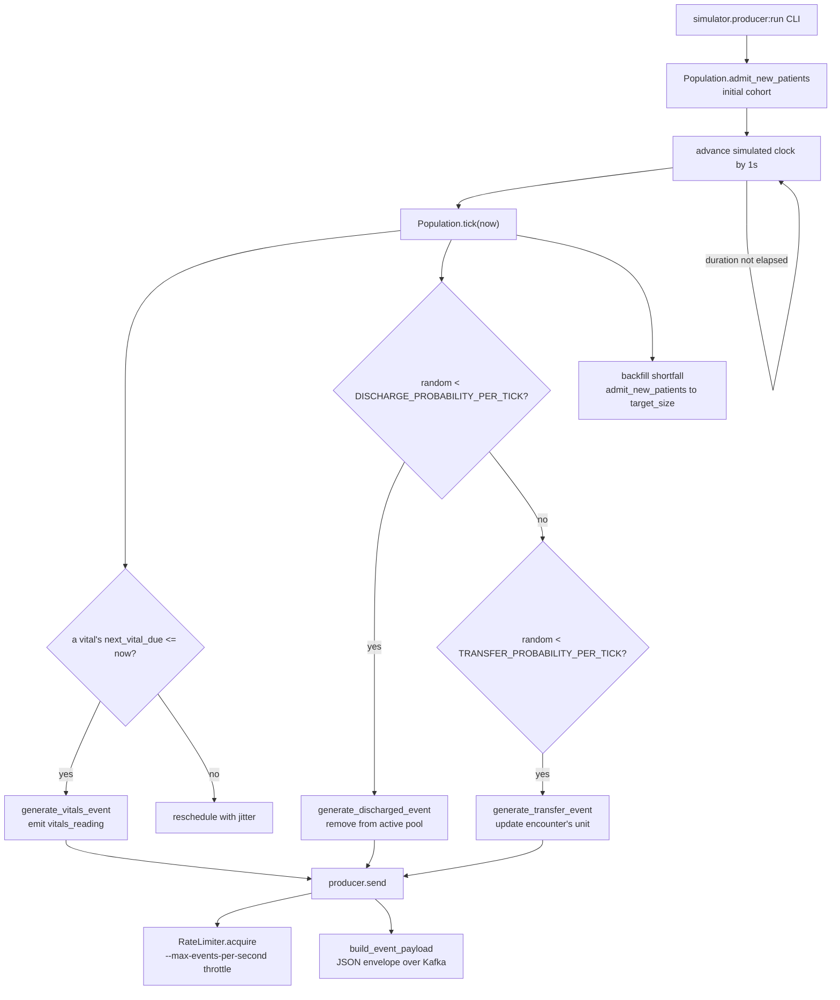
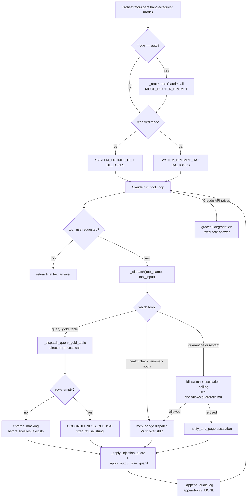
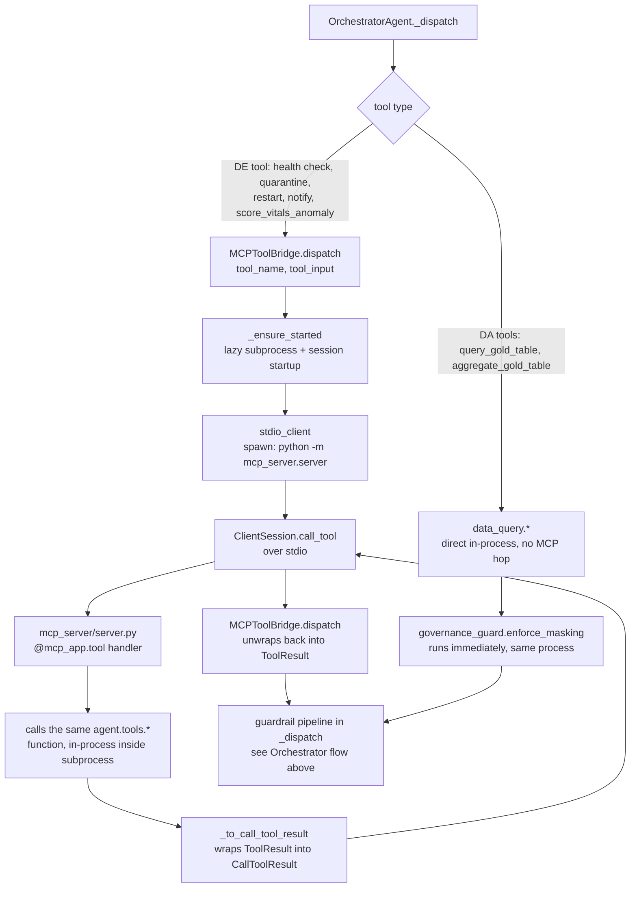
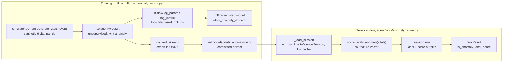
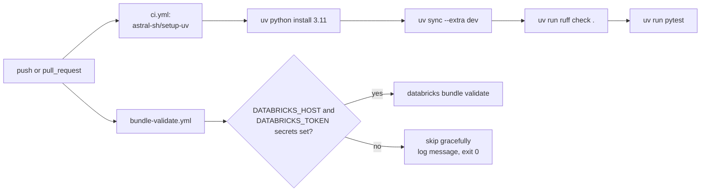

# Databricks Agentic DE

A healthcare streaming-data platform (Kafka/Autoloader → Delta Live Tables →
Unity Catalog) kept healthy and made queryable by one hand-built Claude
tool-calling agent, instead of a vendor no-code tool. The agent runs in two
modes — DE (pipeline self-healing) and DA (governed plain-English Q&A) — with
PHI masking and prompt-injection defense enforced in code and proven by
tests, not just described in a system prompt.

**Status: in development.** The agent, simulator, MCP tool layer, and ML
lifecycle run and are tested locally today. The Databricks/GCP platform code
(DLT pipelines, Unity Catalog SQL, Asset Bundle, Terraform) is structurally
complete but has never executed against a real workspace — see
[Feature status](#feature-status) for the precise, per-component breakdown.

## System overview



Solid boxes are built and tested locally (or structurally complete for
Databricks). Dashed boxes (Databricks AI Search, Genie) are pending a live
GCP-connected Databricks workspace — see
[`docs/comparisons/`](docs/comparisons/) for why those aren't faked. The
sections below break this diagram into one flow per stage, each with its own
diagram and rules/edge-case notes. For the full architectural rationale
behind each decision, see [`docs/architecture.md`](docs/architecture.md).

---

## Repository structure

```
databricks-agentic-de/
├── agent/                          # the locally-runnable orchestrator agent
│   ├── orchestrator.py             # OrchestratorAgent: mode routing, dispatch, guardrail wiring
│   ├── healthcheck.py              # orchestrator_healthcheck entry point for the scheduled DE-mode job
│   ├── llm.py                      # Claude wrapper: tool-calling loop, retry/timeout, optional Langfuse
│   ├── mcp_bridge.py                # MCPToolBridge: MCP client, talks to mcp_server/server.py over stdio
│   ├── prompts.py                  # MODE_ROUTER_PROMPT, SYSTEM_PROMPT_DE, SYSTEM_PROMPT_DA
│   ├── state.py                    # OrchestratorResult dataclass
│   ├── secrets.py                  # GCP Secret Manager, no-op unless GCP_PROJECT_ID is set
│   ├── databricks_client.py        # Databricks REST client (SQL statements, Pipelines API), no-op unless configured
│   ├── otel.py                     # OpenTelemetry tracer, no-op unless OTEL_EXPORTER_OTLP_ENDPOINT is set
│   └── tools/
│       ├── pipeline_health.py      # DE tools: check_expectation_metrics, quarantine, restart, notify_and_page
│       ├── pipeline_health_live.py # live-workspace backend for the DE tools (Pipelines API)
│       ├── data_query.py           # DA tools: query_gold_table + aggregate_gold_table (DuckDB locally, SQL warehouse when configured)
│       ├── governance_guard.py     # enforce_masking + scan_for_injection guardrails
│       ├── anomaly_score.py        # score_vitals_anomaly: ONNX inference
│       └── knowledge_search.py     # Databricks Vector Search tool (Stubbed, degrades cleanly)
├── mcp_server/
│   └── server.py                   # real MCP server exposing the agent/tools/* functions over stdio
├── common/
│   └── contracts.py                # single source of truth: event schema, masked columns, Pydantic models
├── simulator/                      # locally-runnable patient-event + provider-roster generators
│   ├── domain.py                   # pure event/entity generators (Synthea/MIMIC-IV-shaped, synthetic values)
│   ├── population.py               # Population.tick(): admit/transfer/discharge + vitals cadence
│   ├── producer.py                 # Kafka/Redpanda publisher CLI, retry + rate limiting + OTel spans
│   ├── autoloader_feed.py          # provider-roster JSON batch-file writer CLI
│   └── chaos.py                    # adversarial payload builders used by the test suite
├── ml/
│   ├── train_anomaly_model.py      # trains IsolationForest, logs to local MLflow, exports ONNX
│   └── models/vitals_anomaly.onnx  # committed inference artifact
├── pipeline/                       # Databricks-only DLT; structurally complete, never run here
│   ├── 01_ingest/                  # kafka_patient_events.py, autoloader_provider_roster.py
│   ├── 02_bronze/                  # bronze_patient_events.py, bronze_provider_roster.py
│   ├── 03_silver/                  # silver_patient_events.py (hard stop), silver_encounters.py (apply_changes), silver_vitals.py (watermark), silver_providers.py
│   ├── 04_gold/                    # gold_encounters.py, gold_providers.py, gold_vitals.py (+ streaming aggregate)
│   └── common/schemas.py           # PySpark StructTypes, cross-checked against common/contracts.py
├── governance/05_unity_catalog/    # Unity Catalog SQL; Databricks-only, never run here
│   ├── catalog_and_grants.sql      # catalog/schema/group DDL, orchestrator_agent minimum-necessary grant
│   ├── row_filters_and_masking.sql # column masks (full_name/mrn) + unit-scoped row filter
│   ├── access_policy_notes.md      # human-readable policy writeup
│   ├── lineage_notes.md            # what UC lineage would show once deployed
│   └── bigquery_federation_example.sql  # illustrative Lakehouse Federation SQL (Stubbed)
├── infra/
│   ├── terraform/                  # GCS bucket, service account, Pub/Sub, Secret Manager (Stubbed, never applied)
│   └── cloudrun/                   # Dockerfile + deploy.sh for the simulator (Stubbed, never built/deployed)
├── resources/                      # Databricks Asset Bundle resources
│   ├── dlt_pipeline.yml            # two DLT pipeline definitions (streaming + reference-data)
│   └── workflows.yml               # reference_data_hourly job, agent_pipeline_healthcheck job
├── databricks.yml                  # Asset Bundle root config (dev/prod targets, GCP workspace placeholder)
├── data/
│   ├── seed/gold_seed.sql          # DuckDB seed for the local Gold stand-in data_query.py runs against
│   ├── state/pipeline_state.example.json  # DE-mode state-file shape (expectations, jobs, kill switch)
│   ├── knowledge/clinical_protocols.md    # demo content for knowledge_search.py
│   └── reference/synthea_sample/   # reference-only Synthea CSV sample; not read at runtime
├── docs/
│   ├── architecture.md             # full design rationale for every flow below
│   ├── comparisons/                # Genie / Agent Bricks / Vertex AI evaluation plans (Target, not built yet)
│   ├── flows/guardrails.md         # escalation ceiling, kill switch, audit trail, anomaly detection (this doc)
│   └── restructure-proposal.md     # optional layout suggestions, not applied
├── tests/                          # mocked Anthropic client, zero network calls, 287 tests
├── .github/workflows/              # ci.yml (lint+test), bundle-validate.yml (Databricks-gated)
├── docker-compose.yml              # local Redpanda broker + console
├── .env.example                    # local environment variable template
└── pyproject.toml                  # uv-managed deps, ruff config, pytest config
```

---

## Flow: Event ingestion → medallion pipeline

**Status: Databricks-only, structurally complete, never executed in this
environment.** Requires a real cluster with `dlt`/`pyspark` and a reachable
broker.



One consistent Delta Live Tables expectations model runs end-to-end instead
of mixing DLT with hand-rolled Structured Streaming, so the DE-mode tools
(`agent/tools/pipeline_health.py`) can query expectation metrics uniformly
across every table.

**Two ingestion paths, deliberately different tools**: Kafka/Redpanda carries
the genuinely continuous ADT+vitals stream into a `continuous: true` DLT
pipeline; Autoloader watches a GCS landing path for the provider roster, a
small, slow-changing, file-shaped feed, on an hourly-triggered
(`continuous: false`) pipeline (`resources/workflows.yml:reference_data_hourly`).
This is a real cost decision — an always-on cluster for rarely-changing
reference data would be wasted spend — not an accident of there being two
source systems.

**Bronze never drops a row.** `bronze_patient_events` and
`bronze_provider_roster` use warn-only `dlt.expect` for observability
metrics only; even a malformed payload (routed to `_corrupt_record` by
PERMISSIVE-mode JSON parsing at ingest) is retained so Silver, not Bronze,
makes the keep/drop decision.

**Silver uses two write patterns for two different semantics**:
- `dlt.apply_changes` (CDC/upsert) for `silver_encounters.py`'s
  `silver_fct_encounters`/`silver_dim_patients` — mutable state where
  "latest wins." Each event type carries a different slice of that state
  (`transferred` only has the new unit, `discharged` has none), so each CDC
  source is a view that flattens events onto the target columns, and
  `ignore_null_updates=True` keeps whatever an event doesn't carry. A
  discharge sets `status = 'discharged'` rather than deleting the encounter.
- `withWatermark` + `dropDuplicatesWithinWatermark` (append-only) for
  `silver_vitals.py`'s `silver_fct_vitals` — an immutable time series where a
  new reading is always a new row.

**`known_event_type` is a hard stop.** `silver_patient_events.py` uses
`dlt.expect_or_fail` on `event_type` — an event type outside the four the
system understands (`admitted`, `vitals_reading`, `transferred`,
`discharged`) is a genuine upstream contract break, not a quarantinable
data-quality nuisance, and must fail the pipeline so the orchestrator
escalates via `notify_and_page` instead of silently working around it. That
view reads Bronze unfiltered and is the only Silver dataset that reads Bronze
at all, so no consumer can filter an unknown type away before the check sees
it (`tests/test_dlt_pipeline_graph.py` asserts both). By
contrast, `plausible_vital_value` in `silver_vitals.py` is `expect_or_drop`
(a physically impossible vital is safe to drop silently) and
`known_vital_item` is warn-only `expect` (an unrecognized `itemid` is worth
surfacing, not worth losing the row over). "Physically impossible" is per
vital (`common.contracts.PHYSIOLOGIC_LIMITS`): it drops the 0 a disconnected
device sends, SpO2 above 100%, and Fahrenheit sent as `temp_c`, and keeps
clinical alarms like a heart rate of 145. The expression is evaluated in
DuckDB by `tests/test_plausible_vital_expectation.py`.

**Gold's `gold_live_vitals_by_unit` is a genuine streaming aggregate** — avg
heart rate and an out-of-range count, windowed over a trailing 15 minutes and
grouped by unit — advancing continuously as new vitals arrive, not a batch
job. Each reading counts toward the unit the patient was in *when it was
taken*: an event-time range join against `silver_fct_encounter_history`
(SCD type 2), not the current-state table, so a transfer doesn't move earlier
readings to the new unit. Readings that arrive before their admit event land
in an `UNASSIGNED` unit instead of being dropped. The same history is
published as `gold.fct_encounter_history` for point-in-time questions ("ICU
census at 3am"). The rest of Gold is a thin passthrough that gives BI/agent
consumers a stable, documented table name.

**Gold lives in its own schema.** Both pipelines use DLT's default publishing
mode (`schema: silver` in `resources/dlt_pipeline.yml`), and every
`pipeline/04_gold/` table is published by fully-qualified name into
`healthcare_agentic_de.gold` (`common.contracts.GOLD_SCHEMA`) — the only
schema `orchestrator_agent` can `SELECT` from and the one the Unity Catalog
masks target. Silver sources carry `silver_`-prefixed names because one DLT
pipeline can't define two datasets with the same name.
`tests/test_dlt_pipeline_graph.py` loads every bundle library against a
recording fake `dlt` module and checks the dataset graph statically: no
duplicate names, every read resolves inside its own pipeline, every
agent-queryable table is published to `gold`. It can't check the Spark
transformations themselves; only a real pipeline run can.

---

## Flow: Simulator event-generation loop

**Status: Complete — locally runnable and tested with no external
credentials.**



`Population.tick(now)` takes the current time as an explicit parameter rather
than reading the wall clock, so the exact same loop drives both the real
publisher (`simulator/producer.py`, real `time.sleep` between ticks) and
`tests/test_population_tick.py` (a synthetic clock, no sleep, fully
deterministic).

**Pool size is self-stabilizing.** Every tick backfills any
discharge with a fresh admission so `len(Population.active)` tracks
`target_size` (default 1,000, configurable up to 100,000+) rather than
monotonically draining or growing.

**Realistic noise is deliberate.** `simulator/domain.py`'s
`generate_vitals_event` pushes ~3% of readings
(`OUT_OF_RANGE_PROBABILITY`) outside the clinically-plausible band in
`common.contracts.VITAL_RANGES`, so the downstream Silver expectations and
the anomaly-detection tool both have something real to catch — this is not a
bug in the generator.

**Two independent guardrails on the publish side**: `RateLimiter` (a
token-bucket throttle on the aggregate publish rate, distinct from the
per-vital cadence jitter in `Population.tick`) and `_produce_with_retry`
(exponential-backoff retry around `producer.produce()`, retrying only
`BufferError`/`OSError` — a genuine misconfiguration like an unknown topic is
never blindly retried). `send()` is wrapped in one OpenTelemetry span per
event published (`agent/otel.py`, a no-op exporter unless
`OTEL_EXPORTER_OTLP_ENDPOINT` is set).

**Entity/vitals shapes are modeled on Synthea and MIMIC-IV, not derived from
them.** `simulator/domain.py`'s docstring documents the swap-in path to a
real Synthea/MIMIC-IV export; see
[Dataset sourcing](#dataset-sourcing) below.

---

## Flow: Orchestrator request handling

**Status: Complete — this is the repo's central architectural claim, proven
by `tests/test_masking_guard.py`, `tests/test_prompt_injection_guard.py`, and
`tests/test_orchestrator_mode_routing.py`.**



**Mode routing defaults to `da` on any failure.** `_route` makes one small
Claude call, defensively parses the outermost `{...}` as JSON, and falls back
to `"da"` on a malformed response, an unrecognized `mode` value, or any
exception — the same pattern the sibling `abhay` project's
`ManagerAgent._route` uses. `tests/test_orchestrator_mode_routing.py` proves
both the happy path and both fallback cases.

**Masking happens before a `ToolResult` exists, not after.** `messages` (the
transcript sent to Claude) only ever receives `ToolResult.content` — never
the raw DuckDB row dict — so there is no prompt, however worded, that can
make Claude repeat a value (`dim_patients.full_name`/`mrn`) it was never
given. This is why `_dispatch_query_gold_table` calls
`agent.tools.data_query.query_gold_table` **directly in-process** rather than
through the MCP bridge every other DE-mode tool uses — see the
[MCP tool call path](#flow-mcp-tool-call-path) flow below for the full
reasoning.

**A filter can't be used to confirm a masked value.** `query_gold_table`
refuses a filter on a masked column: masking redacts `full_name` in the
returned rows, but `{"full_name": "Jane Alvarez"}` would otherwise confirm
the name by whether any row came back. Filter keys must be plain identifiers
and values are always bound parameters, on the DuckDB and live-warehouse
backends alike (`tests/test_data_query_live.py`).

**Counts and averages are computed in SQL, not by the model.**
`query_gold_table` returns at most 500 rows, so "how many ICU patients?"
answered by counting returned rows is wrong past 500. `aggregate_gold_table`
runs COUNT / COUNT DISTINCT / AVG / MIN / MAX / SUM with optional
`group_by`, range filters (`where`), and `as_of` for
`fct_encounter_history`, on the same backends with the same column checks
(no masked column as a metric, filter, or group key). **Small-cell
suppression:** a group covering fewer than 11 distinct patients
(`MIN_CELL_SIZE`) comes back with no value and no size, so a count or an
average can't single someone out. A known limit: suppression is per query,
so a suppressed value could still be derived by subtracting other groups from
a total; that's forbidden by the DA prompt, not prevented in code
(`tests/test_aggregate_tool.py`).

**A zero-row result is a refusal, not empty data.** An empty
`query_gold_table` result is short-circuited to a fixed
`GROUNDEDNESS_REFUSAL` string instead of flowing to the model as ordinary
"no rows" data — this closes off a path where the model might otherwise
speculate on a typo'd filter. `SYSTEM_PROMPT_DA` explicitly instructs the
model to treat that message as "cannot answer," never as license to guess.

**Every tool result is scanned for injection, regardless of path.**
`governance_guard.scan_for_injection` runs on the content of every dispatch
result — masked query rows, pipeline-health JSON, anything — and wraps
flagged content in `<untrusted_data>` tags before it reaches `messages`.
This is a heuristic, best-effort layer (documented as such in its own
docstring); the real PHI-leakage guarantee is `enforce_masking`, which runs
unconditionally regardless of what the scan finds.

**Output is size-capped before it ever reaches the transcript.**
`MAX_TOOL_RESULT_ROWS` (500) truncates an oversized `query_gold_table`
result and `MAX_TOOL_RESULT_CHARS` (20,000) caps any tool result's content —
both from `common/contracts.py`, applied in `_dispatch` before the audit log
write.

**A Claude API failure never crashes the caller.** `handle()` wraps
`run_tool_loop` in a `try`/`except` and returns a fixed, clearly-worded
result on any exception — the pipeline's own DLT hard-stop expectations keep
enforcing data quality completely independently of whether this agent is
reachable.

See [`docs/flows/guardrails.md`](docs/flows/guardrails.md) for the
escalation-ceiling, kill-switch, audit-trail, and anomaly-detection guardrail
mechanics referenced above.

---

## Flow: MCP tool call path

**Status: Complete — `tests/test_mcp_server_tools.py` spins up a real
`mcp_server/server.py` subprocess over stdio (a local pipe, not a network
call) and re-proves masking and audit-trail guarantees hold MCP-routed.**



DE-mode tool calls (`check_expectation_metrics`, `check_job_status`,
`detect_schema_drift`, `quarantine_bad_records`, `restart_pipeline`,
`notify_and_page`, `score_vitals_anomaly`) are real Model Context Protocol
calls, not in-process function calls, even though the MCP server runs on the
same machine. **DA-mode's `query_gold_table` is the deliberate exception**:
per `agent/orchestrator.py`'s own comment, masking must be the very next
thing that happens to a raw row after it's read, and routing that call
through an extra process boundary first would add an unmasked-PHI
serialize/deserialize hop across a real process boundary for zero benefit —
`query_gold_table` has no side effects to standardize, unlike the DE
remediation tools. `mcp_server/server.py` does expose a `query_gold_table`
MCP tool for protocol-surface completeness (it returns **raw, unmasked**
rows by design — `tests/test_mcp_server_tools.py`'s
`test_query_gold_table_mcp_tool_returns_raw_unmasked_rows` makes this risk
concrete), but the production dispatch path never calls it.

**One subprocess, not one per call.** A fresh MCP server subprocess
re-imports `anthropic`/`structlog`/`onnxruntime`/the `mcp` SDK on every
start (~3-4s, dominated by those packages' own import time). `MCPToolBridge`
starts the subprocess and session lazily on first use and keeps them alive
on a dedicated background thread for the bridge's lifetime;
`agent.mcp_bridge.get_default_bridge()` is a process-wide singleton so that
cost is paid once per process, not once per `OrchestratorAgent()`.

**Why MCP at all, given it's still the same process's own tools**: protocol
standardization. Any MCP-speaking client — not just this project's
`OrchestratorAgent` — can discover and call these tools with zero
project-specific glue code once they're exposed over the standard protocol.

---

## Flow: ML lifecycle — training and inference

**Status: Complete — a real, trained `IsolationForest`, tracked via local
file-based MLflow, exported to ONNX, and served via `onnxruntime` with zero
network calls at inference time.**



**Why a joint model on top of the per-column range checks.**
`common.contracts.VITAL_RANGES` (used by the simulator and the Silver DLT
expectations) can only ever flag one out-of-band vital at a time. The
`IsolationForest` scores all six vitals together, so it catches a reading
where every individual value is technically in-range but the *combination*
isn't — a normal heart rate with a critically low SpO2 and an elevated
respiratory rate at once.

**Training data comes from the same generator as the live stream, not a
separate source.** `_generate_feature_matrix` calls
`simulator.domain.generate_vitals_event` once per vital type per row — the
identical function that drives the Kafka stream — so the model's training
distribution and the live event distribution cannot silently diverge.

**Training-time and inference-time dependencies never touch each other.**
`agent/tools/anomaly_score.py` deliberately duplicates `FEATURE_ORDER`
(rather than importing it from `ml/train_anomaly_model.py`) precisely so
that loading it never pulls in `mlflow`/`scikit-learn`/`skl2onnx` — multi-
second imports the hot inference path must never pay. Both modules derive
`FEATURE_ORDER` from the same `common.contracts.VITAL_ITEM_TYPES`, so they
cannot silently drift apart (`tests/test_anomaly_score_tool.py` cross-checks
this).

**The ONNX session is cached, not reloaded per call.**
`_load_session` is wrapped in `functools.lru_cache(maxsize=8)`, keyed by
resolved model path — one orchestrator process scoring many readings never
reparses the ONNX graph after the first call.

**Error handling never crashes the caller.** A missing model file or a
`vitals` dict missing a required feature returns an error `ToolResult`
(`is_error=True`), never an unhandled exception.

**Status note**: `ml/train_anomaly_model.py` is idempotent — re-running
retrains fresh, overwrites the committed ONNX file, and registers a new
MLflow model version. `mlruns/` is gitignored; only the exported
`ml/models/vitals_anomaly.onnx` is committed.

---

## Flow: CI build and deploy

**Status: Complete for `ci.yml` (lint + test on every push to `master` and every PR; the same commands pass locally). The
Databricks-side `bundle-validate.yml` job is a real, working CI job whose
`databricks bundle validate` step is gated on repo secrets this project
doesn't have configured, so it exercises only its own skip path here.**



**Two independent workflows, deliberately.** `ci.yml` (lint + test) always
runs to completion with no external dependency — `uv sync --extra dev` pulls
the `dev` optional-dependency group (`ruff`, `pytest`) from `pyproject.toml`,
and the full 287-test suite makes zero network calls (mocked Anthropic
client throughout). `bundle-validate.yml` checks for
`DATABRICKS_HOST`/`DATABRICKS_TOKEN` repo secrets **before** installing the
Databricks CLI or running `databricks bundle validate`, and exits 0 with a
log line if they're absent, rather than failing CI over infrastructure this
portfolio project doesn't have.

**Status note**: because neither workflow has ever run against a live
Databricks workspace in this environment, `databricks bundle validate` has
never actually validated the bundle end-to-end — its CI job has only ever
exercised the skip branch.

---

## Build requirements

- **Python** 3.11+
- **[uv](https://docs.astral.sh/uv/)** — this project's package manager (no plain `pip`/`venv` workflow is documented or supported here)
- **Docker** (for the local Redpanda broker via `docker-compose.yml`) — optional, only needed to run the simulator against a real broker
- **Databricks CLI** — optional, only needed for `databricks bundle validate/deploy` against a real workspace
- **Terraform** ≥ 1.5.0 — optional, only needed to apply `infra/terraform/` against a real GCP project

### Install uv

```bash
# macOS / Linux
curl -LsSf https://astral.sh/uv/install.sh | sh
```

```powershell
# Windows (PowerShell)
powershell -ExecutionPolicy ByPass -c "irm https://astral.sh/uv/install.ps1 | iex"
```

### Install Docker (for the local Redpanda broker, optional)

```bash
# macOS
brew install --cask docker
```

```powershell
# Windows: install Docker Desktop from https://www.docker.com/products/docker-desktop/
```

---

## Building and running

```bash
# 1. Install runtime + dev dependencies
uv sync --extra dev

# 2. (Optional) start a local Redpanda broker + console (http://localhost:8080)
docker compose up -d

# 3. (Optional) produce a live patient-events stream against that broker
uv run python -m simulator.producer --patients 1000 --duration 60

# 4. (Optional) drop provider-roster batch files
uv run python -m simulator.autoloader_feed

# 5. (Optional) train the anomaly-detection model and re-export ONNX
uv run python -m ml.train_anomaly_model

# 6. Run the full test suite (no broker, no Databricks, no ANTHROPIC_API_KEY needed)
uv run pytest

# 7. Lint
uv run ruff check .
```

```bash
# Databricks-only — requires a real workspace and DATABRICKS_HOST/DATABRICKS_TOKEN
databricks bundle validate
databricks bundle deploy -t dev
```

Copy [`.env.example`](.env.example) to `.env` to set `ANTHROPIC_API_KEY` (only
needed to run the orchestrator agent against the real Claude API — the test
suite mocks this) and other optional configuration.

---

## Commands / binaries / scripts

| Command | Purpose |
|---|---|
| `uv sync --extra dev` | Install runtime + dev dependencies |
| `docker compose up -d` | Start the local Redpanda broker + console |
| `uv run python -m simulator.producer --patients 1000 --duration 60` | Publish a live patient-events stream to Kafka/Redpanda |
| `uv run python -m simulator.autoloader_feed --interval 30 --batches 5` | Drop provider-roster JSON batch files into the landing directory |
| `uv run python -m ml.train_anomaly_model` | Train the `IsolationForest`, log to local MLflow, export ONNX |
| `uv run python -m mcp_server.server` | Run the MCP tool server standalone (manual protocol testing) |
| `uv run orchestrator_healthcheck` | One scheduled-style DE-mode health check (needs `ANTHROPIC_API_KEY`); exit 0 healthy, 1 agent unavailable, 2 escalated |
| `uv run pytest` | Run the full test suite (287 tests, zero network calls) |
| `uv run pytest tests/test_masking_guard.py` | Run one test file |
| `uv run ruff check .` | Lint |
| `databricks bundle validate` | Validate the Asset Bundle against a real workspace (Databricks-only) |
| `databricks bundle deploy -t dev` | Deploy the Asset Bundle to the `dev` target (Databricks-only) |
| `terraform init && terraform plan -var="gcp_project_id=..."` | Plan the GCP infrastructure in `infra/terraform/` (never applied here) |

---

## API / usage

### Orchestrator agent (Python)

```python
from agent.orchestrator import OrchestratorAgent

agent = OrchestratorAgent()  # reads ANTHROPIC_API_KEY from the environment

result = agent.handle("How many patients are currently in the ICU?", mode="auto")
print(result.mode)          # "da"
print(result.answer)        # plain-English answer, grounded in masked Gold rows
print(result.tool_calls)    # ["query_gold_table"]
```

### DA-mode tool call shape (`query_gold_table`)

```json
{
  "table": "dim_patients",
  "filters": {"region": "midwest"}
}
```

returns masked rows:

```json
[{"patient_id": "pt_00001", "mrn": "***REDACTED***", "full_name": "***REDACTED***", "birth_date": "1968-04-02", "gender": "female", "region": "midwest"}]
```

### DE-mode tool call shape (`quarantine_bad_records`)

```json
{"table": "silver_vitals", "expectation": "plausible_vital_value"}
```

### MCP server (standalone)

```bash
uv run python -m mcp_server.server
```

Speaks standard MCP over stdio; discoverable tools are
`check_expectation_metrics`, `check_job_status`, `detect_schema_drift`,
`quarantine_bad_records`, `restart_pipeline`, `notify_and_page`,
`query_gold_table`, `score_vitals_anomaly`.

### Simulator CLI

```bash
uv run python -m simulator.producer --patients 1000 --duration 60 \
  --bootstrap-servers localhost:19092 --max-events-per-second 500
```

---

## Feature status

Three categories, precisely (see `docs/architecture.md` and each flow
section above for the file-by-file detail): what runs and is tested locally
right now (**Complete**); Databricks/GCP platform code that is structurally
correct but only ever resolves on that platform, independent of any
particular workspace's setup progress (**Partial**); and scaffolding that is
either a real, graceful-degradation-only code path never exercised against
live infrastructure, or pure planning with no implementation at all
(**Stubbed** / **Target (not built yet)**).

| Feature | Status |
|---|---|
| Patient-event + provider-roster simulator (`simulator/`) | Complete |
| Orchestrator agent — DE mode (pipeline self-healing) | Complete |
| Orchestrator agent — DA mode (governed Q&A) | Complete |
| PHI masking (`governance_guard.enforce_masking`) | Complete |
| Prompt-injection heuristic scan (`governance_guard.scan_for_injection`) | Complete |
| MCP server + client bridge (`mcp_server/`, `agent/mcp_bridge.py`) | Complete |
| Escalation ceiling, kill switch, immutable audit trail | Complete |
| Human approval for remediation (`agent/approvals.py`; quarantine/restart queue until a named person approves; requests expire after 4h) | Complete - approver is a recorded name, not an authenticated identity |
| Behavioral anomaly detection (`detect_anomalous_activity`) | Complete |
| Retry + timeout (Claude calls, Kafka produce) | Complete |
| Rate limiting (`simulator/producer.py:RateLimiter`) | Complete |
| Graceful degradation on Claude API failure | Complete |
| ONNX joint anomaly-scoring model + training pipeline (`ml/`) | Complete |
| Genie glue + guardrails (`agent/tools/genie.py`: `ask_genie` routes DA questions to a Genie space; PHI-request refusal, SQL schema check, masking backstop incl. leaked values in Genie's text, small-count suppression) | Stubbed - tested against a mocked Genie Conversation API only; no Genie space exists yet. Falls back to the agent's own tools when unconfigured |
| DuckDB-backed local Gold stand-in (`agent/tools/data_query.py`) | Complete |
| Live-workspace DA queries — SQL Statement Execution API against `healthcare_agentic_de.gold` (`agent/databricks_client.py`, `data_query.py`) | Stubbed — request/response handling tested against a mocked transport only; never run against a real warehouse. No-op unless `DATABRICKS_HOST`/`DATABRICKS_TOKEN`/`DATABRICKS_WAREHOUSE_ID` are set |
| Live-workspace DE tools — expectation metrics, pipeline status, restart via the Pipelines API (`agent/tools/pipeline_health_live.py`) | Stubbed — tested against a mocked transport only; never run against a real workspace. `detect_schema_drift`/`quarantine_bad_records` have no live equivalent and return an escalate-instead error; `notify_and_page` has no paging integration yet |
| Observability tracing — Langfuse (LLM calls), OpenTelemetry (infra) | Complete (no-op unless configured; real export not exercised against a live backend here) |
| GCP Secret Manager integration (`agent/secrets.py`) | Complete (no-op unless `GCP_PROJECT_ID` is set) |
| Scheduled DE health-check job (`agent/healthcheck.py`, `resources/workflows.yml:agent_pipeline_healthcheck`) | Partial — CLI tested locally, and the built wheel was installed into a clean venv and its entry point, MCP server, and ONNX model exercised from there; the job itself has never run on Databricks. Needs a `healthcare_agentic_de` secret scope and the `ops.agent_state` volume first |
| Real-time problem catalog + `lookup_problem` tool (`agent/knowledge/problem_catalog.yaml`, `agent/tools/problem_catalog.py`) | Complete - 104 problems with expected response and autonomy level; matching tested on hand-written incident descriptions (not an independent benchmark) |
| Scenario evals (`evals/`) | Partial - harness, graders, and 14 scenarios tested with a scripted model; **not yet run against the real model**, so no pass rate exists |
| CI — lint + test (`.github/workflows/ci.yml`) | Complete |
| CI — bundle validate (`.github/workflows/bundle-validate.yml`) | Complete (its skip path is what actually runs here; `databricks bundle validate` itself is untested) |
| DLT medallion pipeline (`pipeline/`) | Partial — never run; only resolves on a real Databricks cluster. Its dataset graph (names, reads, schema placement) is checked statically by `tests/test_dlt_pipeline_graph.py`; the Spark transformations are not |
| Unity Catalog grants + masking/row-filter SQL (`governance/05_unity_catalog/*.sql`, excluding BigQuery federation) | Partial — structurally correct, never run against a real metastore |
| Databricks Asset Bundle (`databricks.yml`, `resources/*.yml`) | Partial — structurally correct, never deployed |
| Databricks Vector Search knowledge tool (`agent/tools/knowledge_search.py`) | Stubbed — real graceful-degradation code path, never queried a live index |
| Lakehouse Federation to BigQuery example | Stubbed — illustrative SQL, never run |
| Terraform GCP infrastructure (`infra/terraform/`) | Stubbed — structurally correct, `terraform apply` never run |
| Cloud Run simulator deployment (`infra/cloudrun/`) | Stubbed — never built or deployed |
| Platform-comparison evaluation plans (`docs/comparisons/`) | Target (not built yet) — criteria/methodology only, explicitly marked pending, no results |

---

## Testing

```bash
uv run pytest            # full suite: 287 tests, ~110s, zero network calls
uv run pytest -q         # quiet output
uv run pytest tests/test_masking_guard.py tests/test_prompt_injection_guard.py  # the two core guardrail proofs
uv run ruff check .      # lint
```

Tests live in [`tests/`](tests/), one file per concern: contracts/Pydantic
validation, PHI masking, prompt-injection defense, mode routing, MCP server
round-trips, escalation ceiling, kill switch, audit trail, anomaly
detection (both the behavioral guardrail and the ONNX model), Claude
retry/timeout, OpenTelemetry tracing, GCP secrets, tool allowlisting,
chaos-payload-driven remediation scenarios, the population tick loop, and
schema/contract cross-consistency between `common/contracts.py`,
`pipeline/common/schemas.py`, and `simulator/domain.py`.

The Anthropic client is always injected (`Claude` is never constructed
globally inside `OrchestratorAgent`), so every test substitutes a scripted
fake with the same `run_tool_loop` signature — the suite passes with no
`ANTHROPIC_API_KEY` set. `tests/test_mcp_server_tools.py` is the one file
that spins up a real subprocess (`mcp_server/server.py` over stdio), but
stdio is a local pipe, not a network socket.

---

## Dataset sourcing

The stream is produced entirely by this repo's own generator
(`simulator/`), not replayed from a file. Its entity shapes are modeled on
Synthea's FHIR resources and its vitals-over-time structure is modeled on
MIMIC-IV's `chartevents` table, cited for schema-shape credibility only — no
real Synthea or MIMIC-IV data is used. A small, openly-licensed Synthea CSV
sample (100 synthetic patients) is committed at
[`data/reference/synthea_sample/`](data/reference/synthea_sample/) as a
documented reference artifact only — nothing reads it at runtime; see
[`SOURCE.md`](data/reference/synthea_sample/SOURCE.md) for the license,
citation, and the swap-in path if you want to build against it directly.

## Further reading

- [`docs/architecture.md`](docs/architecture.md) — full design rationale for every flow above, plus the complete guardrail table with implementing-file/test pointers.
- [`docs/flows/guardrails.md`](docs/flows/guardrails.md) — escalation ceiling, kill switch, audit trail, and behavioral anomaly detection in detail.
- [`docs/agent_problem_catalog.pdf`](docs/agent_problem_catalog.pdf) — 104 real-time DE/DA problems on this Databricks stack (pipelines, governance, overload, outages, timestamps, data content, changes to production, analyst SQL), how the agent should handle each, its repo status, and the agent training/eval plan. Rebuild with `uv run --no-project --with reportlab --with pyyaml python scripts/build_problem_catalog.py`.
- [`docs/comparisons/`](docs/comparisons/) — Genie, Agent Bricks, and Vertex AI evaluation plans (pending a live workspace).
- [`docs/restructure-proposal.md`](docs/restructure-proposal.md) — optional layout suggestions surfaced while writing this documentation; not applied.
- [`AGENTS.md`](AGENTS.md) — instructions for AI coding agents working in this repo.
