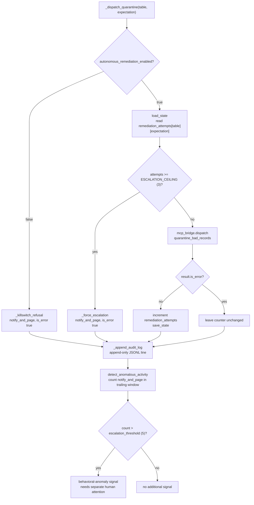

# Flow: Guardrail enforcement (escalation ceiling, kill switch, audit trail, anomaly detection)

Linked from [`README.md`](../../README.md)'s
[Orchestrator request handling](../../README.md#flow-orchestrator-request-handling)
flow, split out here because the state machine around
`quarantine_bad_records`/`restart_pipeline` — the only two tools anywhere in
this codebase that mutate pipeline/job state
(`tests/test_tool_allowlist.py`) — is dense enough to crowd the main
dispatch diagram. Everything below is implemented in
[`agent/orchestrator.py`](../../agent/orchestrator.py) and proven by
`tests/test_escalation_ceiling.py`, `tests/test_kill_switch.py`,
`tests/test_audit_trail.py`, and `tests/test_anomaly_detection.py`.

**Status: Complete.** All four guardrails run locally with no external
dependency — the state they read/write is a local JSON file
(`data/state/pipeline_state.json`, gitignored; shape documented in
`data/state/pipeline_state.example.json`) and a local append-only JSONL
audit log (`data/state/audit_log.jsonl`, gitignored).

**Escalation ceiling — the model cannot self-limit a retry loop, so code
does.** `_dispatch_quarantine` tracks consecutive successful quarantine
attempts per `(table, expectation)` pair in the state file's
`remediation_attempts` map. On the 4th attempt at a pair that's still
failing (`ESCALATION_CEILING = 3`), the dispatch wrapper refuses the
quarantine outright and forces `notify_and_page` instead — this check runs
*before* the tool call, in `agent/orchestrator.py`, not as an instruction
the model could ignore or misjudge. `SYSTEM_PROMPT_DE` tells the model not
to retry an action a guardrail refused, but the ceiling itself does not
depend on the model complying with that instruction.

1. Read `remediation_attempts[table][expectation]` from the state file (0 if absent).
2. If `>= ESCALATION_CEILING`, call `_force_escalation` — escalate and stop, do not attempt the quarantine.
3. Otherwise dispatch `quarantine_bad_records` via the MCP bridge.
4. On success, re-read the state file (not a stale in-memory copy — the quarantine call already wrote to it) and increment the counter before saving.
5. On failure, leave the counter unchanged — a failed attempt doesn't consume ceiling headroom.

**Kill switch — a platform-wide off switch for mutation, not for
observation.** `_autonomous_remediation_enabled` reads
`autonomous_remediation_enabled` from the state file, defaulting to `True`
if the key is absent (so state files predating this flag keep working as
"enabled"). It gates exactly `quarantine_bad_records` and
`restart_pipeline` — the two mutating tools. Read-only health checks
(`check_expectation_metrics`, `check_job_status`, `detect_schema_drift`) and
`notify_and_page` itself are **never** gated: a disabled kill switch must
still let the agent see and report on pipeline state, and must still let it
escalate to a human.

**Immutable audit trail — append-only by construction, not by convention.**
`_append_audit_log` opens the audit log file with mode `"a"`, never `"w"`,
so normal operation can only ever grow the file. Every single `_dispatch()`
call writes exactly one JSONL line — tool name, input, the *already-masked*
output (never a raw pre-mask value, since `result` here has already survived
the masking/injection-guard/size-guard pipeline), and the `is_error` flag.
This is a real file-append operation, not a database transaction, so there
is no rollback: a crash mid-write can at most corrupt the last line, never
an earlier one.

**Behavioral anomaly detection — a signal, not an action.**
`detect_anomalous_activity` is a pure function: given the audit log path and
a trailing time window (default 60 minutes), it counts `notify_and_page`
entries in that window and returns `True` if the count exceeds
`escalation_threshold` (default 5). It takes `now` as an explicit optional
parameter rather than always reading the wall clock, so
`tests/test_anomaly_detection.py` can drive it deterministically against a
synthetic log with controlled timestamps. A `True` result means one of two
things — a real widespread incident (many independent genuine failures) or
the agent itself misbehaving (stuck in an escalation loop) — and either way
is worth a human's attention beyond the individual pages already sent. This
function does not itself page anyone or change behavior; it is a query a
caller (or a real deployment's monitoring stack) would act on.

**`restart_pipeline` follows the kill switch only, not the escalation
ceiling.** `_dispatch_restart` checks `_autonomous_remediation_enabled` the
same way `_dispatch_quarantine` does, but has no per-pipeline attempt
counter — a restart is a single bounded action (simulated as instantaneous
in `agent/tools/pipeline_health.restart_pipeline`), not a repeated fix
attempt against the same failing condition, so there is no retry loop for a
ceiling to bound.

**Status note**: `RateLimiter.acquire` (the simulator's publish-side rate
limit, a different guardrail from the four above) is exercised via a direct
unit test but has no live-broker integration test — see
[`README.md`](../../README.md#feature-status).
