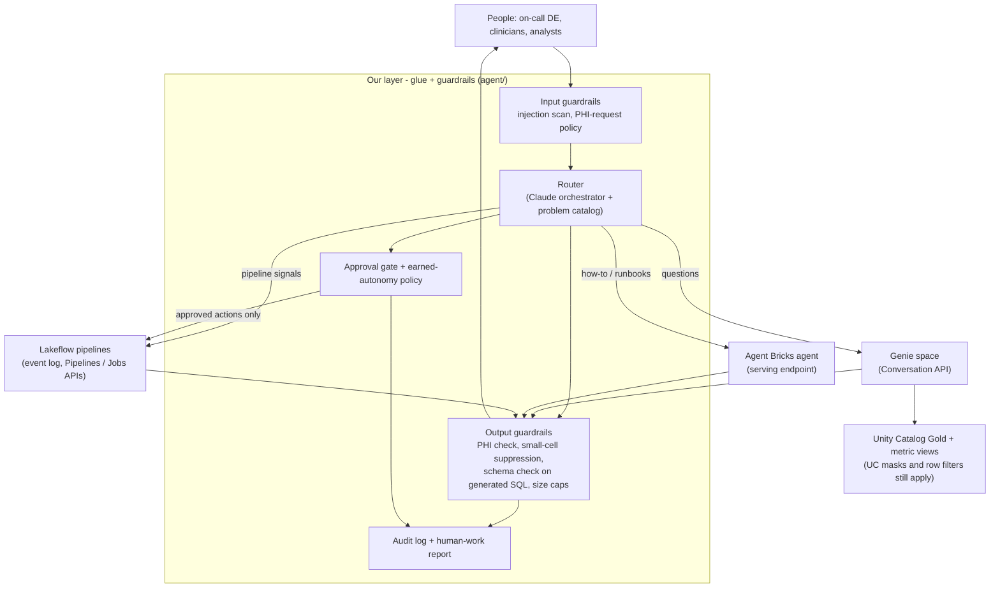

# Plan: less human work, humans only where they're needed

**Goal.** Cut the routine work data engineers and analysts do on this
platform, and the number of times a person has to step in, as far as is
safe. People stop doing toil; they only make the decisions that need
judgment or carry real risk, and each of those takes seconds, not an
investigation.

**How (what companies actually do).**
- **The work:** platform agents do it, configured rather than built: Genie
  for questions, Databricks Assistant / Lakeflow monitoring for pipeline
  issues, Agent Bricks for knowledge.
- **What we build:** the glue that connects them to the platform, and the
  guardrails that make them safe.
- **Autonomy is earned:** start with a person approving every action;
  measure; let proven low-risk action classes run on their own; keep
  high-risk ones human forever.

Status note: nothing below has been measured yet; any target numbers are
goals, not results.

## 1. Measure human work first

Without a baseline, "less human work" is a claim, not a result. Everything
here comes from data the system already records (audit log, approval
requests, healthcheck runs, eval results). A weekly **human-work report** is
glue we build.

| Area | What we count | Lower is better unless noted |
|---|---|---|
| Pipeline operations | Incidents per week, by catalog problem ID | - |
| | Incidents resolved with no human action | Higher is better |
| | Pages sent; pages that turned out not to need a person | Lower |
| | Time from detection to resolution | Lower |
| Approvals | Requests per week; approve vs reject rate | - |
| | Time a person spends per decision (request -> decision) | Lower |
| | Approved actions that then failed or were rolled back | Must stay near zero |
| Analyst questions | Questions answered with no analyst involved | Higher is better |
| | Answers an analyst had to correct (from evals and feedback) | Lower |
| Safety (never traded away) | PHI leaks, injection successes, suppressed-cell disclosures | Must be zero |

## 2. Earned autonomy: approvals that retire themselves

Every action the agent can take belongs to an **action class**: catalog
problem ID x action, e.g. "B1 x quarantine_bad_records on silver_vitals".
Each class has a policy:

| Policy | Meaning | Who can change it |
|---|---|---|
| `always_human` | Every execution needs a person, forever | Nobody automatically |
| `approval` | Queued until a person approves (built: `agent/approvals.py`) | Starting policy for everything else |
| `auto` | Runs on its own, still inside kill switch, escalation ceiling, audit | Promoted only as below |

**Promotion `approval` -> `auto`:**
- Only for catalog level L2 problems (bounded, reversible).
- Only after N approved executions in a row (e.g. 10) that succeeded, with
  zero rejections and zero failures in the window.
- A person signs off the promotion once; it's logged.

**Demotion back to `approval`** is automatic on the first failure, rollback,
rejection, or new kind of error.

**`always_human`, never promotable:**
- L0/L1 problems: contract breaks, data loss, schema drift;
- anything destructive (full refresh, VACUUM, drops);
- grant, mask or IAM changes;
- anything on the prod target;
- new problems that don't match the catalog.

This is how human work goes down safely: the routine decisions a person kept
approving stop needing them, and the record shows why.

## 3. Make every remaining human decision cheap

When a person is needed, the agent does the investigation and the person
only decides.

- **Approval requests carry evidence:**
  - the catalog problem ID and its runbook;
  - the numbers that triggered it;
  - exactly what will change, and the rollback.
- **The request goes to the owner of that table or pipeline**, not a shared
  inbox.
- **One action to decide:** a command today; a chat button or approvals
  page later.
- **Duplicates collapse into one request.** Requests expire (built: 4 hours)
  so nobody approves a stale action.
- **Pages only for things a person must do now.** Everything else goes into
  the daily digest.

## 4. Our agent is the glue-and-guardrail layer

We use the existing agents and stack for the work. Our orchestrator doesn't
answer questions or fix pipelines itself. It routes each request to the right
platform agent or API, checks what goes in and what comes out, holds actions
for approval, and records everything.

Databricks Assistant is an in-product helper with no public API, so the layer
can't call it. People keep using it directly in notebooks and the SQL editor.
Pipeline signals come from the event log and Pipelines/Jobs APIs instead.

When a platform agent isn't configured, the layer falls back to our own
tools (`query_gold_table`, `aggregate_gold_table`, the local DE tools), the
same no-op-unless-configured pattern as the rest of the repo. The same
fallback is the baseline we measure Genie against.

## 4a. What the platform does vs what we build

| Work | Done by (bought / configured) | Glue we build | Guardrails we build |
|---|---|---|---|
| Answer clinical/ops questions | Genie over Gold + metric views | Metrics layer (definitions -> UC metric views + Genie instructions); Genie gateway (Conversation API) | PHI check on Genie output, injection scan, small-cell suppression, audit of question + SQL + answer |
| Spot and explain pipeline failures | Lakeflow monitoring, Databricks Assistant | Pipeline signals -> catalog lookup -> routing to the right owner | Escalation ceiling, kill switch |
| Fix known pipeline problems | Pipelines / Jobs APIs | Remediation actions; approval workflow; earned-autonomy policy | Approvals, policy limits, audit, expiry |
| Answer "how do I fix X" | Agent Bricks knowledge agent (or our catalog lookup) | Problem catalog as its knowledge source | Autonomy level attached to every answer |
| Keep the setup safe as it changes | Unity Catalog | Governance coverage check on every new Gold table | Block exposure until masks / filters exist |
| Prove it works | - | Evals against Genie and our baseline; weekly human-work report | Safety metrics must stay at zero |

Our own Claude orchestrator stays as the **baseline Genie is measured
against** and as a fallback, not as the product.

## 5. Phases

| Phase | What happens | Human work at this point | Exit criterion |
|---|---|---|---|
| 0 - Baseline | Everything on `approval`; run on simulator data; start the weekly report | Highest: a person approves every action | Report produces numbers |
| 1 - Platform + glue | Deploy to the workspace; Genie space with metric views; Genie gateway + output guardrails; evals on Genie and baseline | Same approvals; analysts answer fewer questions | Genie comparison measured; safety metrics zero |
| 2 - Earned autonomy | Promotion/demotion policy live for L2 classes | Approvals fall as classes are promoted | First classes promoted with their evidence |
| 3 - Prove it | Publish before/after: incidents auto-resolved, approvals per week, decision time, questions answered without an analyst | Lowest safe level | Numbers published with method |

## 6. Already built vs next

**Built (tested locally):**
- human approval (`agent/approvals.py`);
- kill switch, escalation ceiling, audit log;
- PHI masking, injection scan, small-cell suppression;
- problem catalog with autonomy levels (`lookup_problem`);
- eval harness;
- healthcheck exit codes (escalation -> 2, approval pending -> 3).

**Next, in order:**
1. **Genie gateway with guardrails:** `ask_genie` routed through the input
   and output guardrails, falling back to our own tools when Genie isn't
   configured. Mock-tested until the workspace exists.
2. **Metrics layer:** one definitions file -> UC metric views + Genie
   instructions, so Genie and the fallback share definitions.
3. **Human-work report:** weekly numbers from the audit log and approvals
   state; the Phase 0 baseline.
4. **Earned-autonomy policy:** per-class policy, promotion/demotion rules,
   always_human list.
5. **Evidence-rich approval requests and owner routing.**
6. **Agent Bricks connection** for runbook / how-to questions.
7. **Deploy and measure:** the workspace, real-model evals, and the Genie
   comparison.
