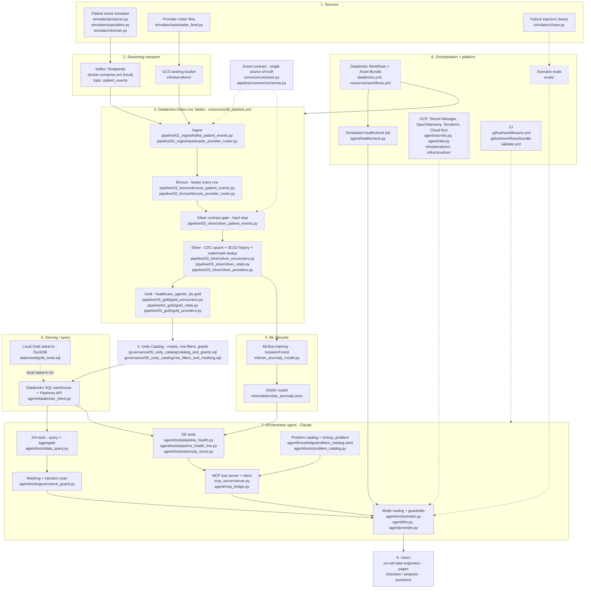

# Real-time stack: flow and where each piece lives in the repo

Repository: <https://github.com/sumanthreddy369/databricks-agentic-de>

Each box shows the technology and the repo path to pull it from. Line
styles:

- solid boxes run and are tested locally;
- dashed boxes are Databricks/GCP code that is written but has never run on
  a workspace;
- dotted boxes are on disk locally but not pushed to GitHub yet.



## Component -> repo path

| Stage | Technology | Repo path | Status |
|---|---|---|---|
| Sources | Python event simulator (patient admit/transfer/discharge + vitals) | `simulator/` | Tested locally |
| Sources | Provider roster batch files | `simulator/autoloader_feed.py` | Tested locally |
| Transport | Kafka / Redpanda (local broker + console) | `docker-compose.yml` | Runs locally |
| Transport | GCS landing bucket | `infra/terraform/` | Never applied |
| Contract | Event schema, masked columns, physical vital limits, cell size | `common/contracts.py`, `pipeline/common/schemas.py` | Tested locally |
| Ingest | Spark Structured Streaming from Kafka; Autoloader (cloudFiles) | `pipeline/01_ingest/` | Never run on Databricks |
| Bronze | DLT streaming tables | `pipeline/02_bronze/` | Never run on Databricks |
| Silver | DLT `apply_changes` (SCD1 + SCD2), watermark + dedup, expectations | `pipeline/03_silver/` | Graph test only |
| Gold | DLT tables in `healthcare_agentic_de.gold` + streaming aggregate | `pipeline/04_gold/` | Graph test only |
| Pipeline config | Asset Bundle pipelines | `resources/dlt_pipeline.yml` | Never deployed |
| Governance | Unity Catalog masks, row filters, grants, ops volume | `governance/05_unity_catalog/` | Never run |
| ML | IsolationForest -> MLflow -> ONNX | `ml/train_anomaly_model.py`, `ml/models/` | Tested locally |
| Serving | Databricks SQL Statement Execution API + Pipelines API | `agent/databricks_client.py` | Mock-tested only |
| Serving (local) | DuckDB Gold stand-in | `data/seed/gold_seed.sql` | Tested locally |
| Agent | Claude tool loop, mode routing, guardrails | `agent/orchestrator.py`, `agent/llm.py`, `agent/prompts.py` | Tested locally |
| Agent | PHI masking + prompt-injection scan | `agent/tools/governance_guard.py` | Tested locally |
| Agent | MCP server + client (DE tools) | `mcp_server/server.py`, `agent/mcp_bridge.py` | Tested locally |
| Agent | DE tools (local + live) | `agent/tools/pipeline_health.py`, `agent/tools/pipeline_health_live.py` | Local tested; live mock-tested |
| Agent | DA tools (query + aggregate, small-cell suppression) | `agent/tools/data_query.py` | Tested locally |
| Agent | Problem catalog + `lookup_problem` | `agent/knowledge/problem_catalog.yaml`, `agent/tools/problem_catalog.py` | Tested locally; **not pushed yet** |
| Agent | Vector Search knowledge tool | `agent/tools/knowledge_search.py` | Stubbed |
| Orchestration | Workflows: hourly roster job, 15-min agent healthcheck | `resources/workflows.yml`, `agent/healthcheck.py` | CLI tested; job never run |
| Platform | GCP Secret Manager, OpenTelemetry | `agent/secrets.py`, `agent/otel.py` | No-op unless configured |
| Platform | Terraform, Cloud Run | `infra/` | Never applied |
| Quality | CI (lint + tests), bundle validate | `.github/workflows/` | CI passing on GitHub |
| Quality | Scenario evals for the agent | `evals/` | Harness tested; **not pushed yet**; real-model runs not done |
| Docs | Problem catalog PDF + generator | `docs/agent_problem_catalog.pdf`, `scripts/build_problem_catalog.py` | Pushed |

## Pulling it

Clone the whole repo:

```bash
gh repo clone sumanthreddy369/databricks-agentic-de
```

Install everything and run the tests:

```bash
uv sync --extra dev
```

```bash
uv run pytest
```

Start the local real-time stream (Redpanda, then the simulator):

```bash
docker compose up -d
```

```bash
uv run python -m simulator.producer --patients 1000 --duration 60
```

To pull only one part, a sparse checkout works. For example, just the
pipeline and its contract:

```bash
git clone --filter=blob:none --sparse https://github.com/sumanthreddy369/databricks-agentic-de.git
```

```bash
git -C databricks-agentic-de sparse-checkout set pipeline common resources
```
